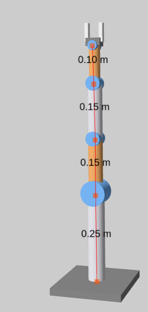
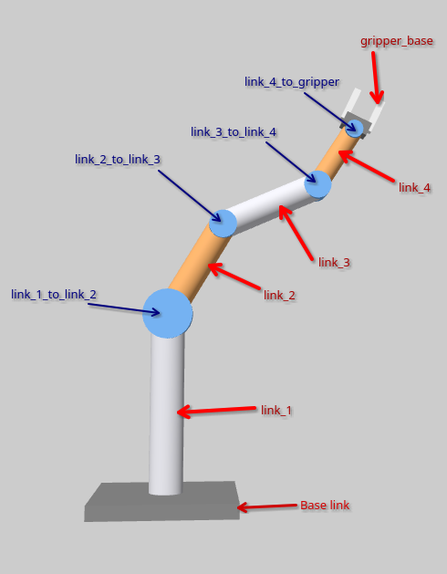
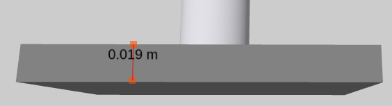
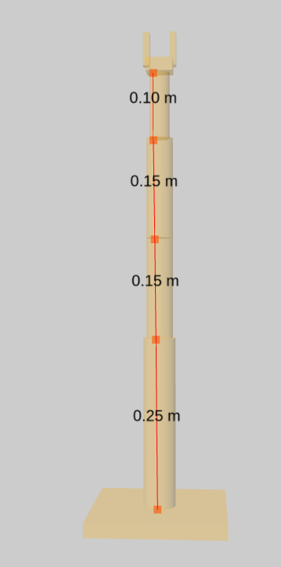

# Semi-Circular Pick and Place Trajectory Simulation

## Overview
This simulation demonstrates a 4-DOF robotic arm performing a pick-and-place operation along a semi-circular trajectory. The robot moves a spherical object from a red source container to a blue destination container, following a precise semi-circular path.


*The complete 4-DOF robot setup*

## Physical Parameters

### Robot Structure

*Detailed view of robot's links and joints*

#### Link Dimensions
| Link | Length (m) | Description |
|------|------------|-------------|
| l1 | 0.27 | Base to first joint height |
| l2 | 0.15 | First arm segment |
| l3 | 0.15 | Second arm segment |
| l4 | 0.10 | End-effector segment |

#### Joint Configuration
| Joint | Type | Range | Max Torque |
|-------|------|--------|------------|
| link_1_to_link_2 | Revolute | ±180° | 50 Nm |
| link_2_to_link_3 | Revolute | ±180° | 50 Nm |
| link_3_to_link_4 | Revolute | ±180° | 50 Nm |
| link_4_to_gripper | Revolute | ±180° | 50 Nm |

### Container Properties
| Parameter | Value | Description |
|-----------|-------|-------------|
| Width | 0.06 m | Container width (X-axis) |
| Length | 0.08 m | Container length (Y-axis) |
| Height | 0.08 m | Container height (Z-axis) |
| Wall Thickness | 0.01 m | Thickness of container walls |
| Base Thickness | 0.01 m | Thickness of container base |

### Ball Properties
| Parameter | Value | Description |
|-----------|-------|-------------|
| Radius | 0.0165 m | Radius of manipulated ball |
| Color | Green (0,1,0,1) | RGBA color values |

## Trajectory Parameters

### Semi-Circle Properties
| Parameter | Default | Range | Description |
|-----------|---------|--------|-------------|
| Center X | 0.25 m | 0.1-0.4 m | X-coordinate of trajectory center |
| Center Z | 0.10 m | 0.1-0.4 m | Z-coordinate of trajectory center |
| Radius | 0.10 m | 0.05-0.15 m | Radius of semi-circular path |
| Points | 250 | - | Number of trajectory points |

### Container Positions
- Source (Red) Container: Offset 1.75cm left of trajectory start point
- Destination (Blue) Container: Offset 1.75cm right of trajectory end point

## Control Parameters

### PD Control Gains
| Parameter | Default | Range | Description |
|-----------|---------|--------|-------------|
| Kp | 0.10 | 0.01-1.0 | Position gain |
| Kd | 0.4 | 0.1-2.0 | Velocity gain |

### Motion Control
- Control Mode: Position Control (PyBullet)
- Maximum Force: 50 N
- Control Frequency: 240 Hz (1/240 second timestep)

## Real-time Visualization

### Main Display
1. End-Effector Trajectory Plot
   - Red line: Target trajectory
   - Blue line: Actual trajectory
   - X-axis: 0 to 0.5 m
   - Z-axis: 0 to 0.5 m

2. Joint Torques Plot
   - Shows torques for all 3 joints
   - Rolling window of last 100 points
   - Auto-scaling Y-axis

3. Joint Angles Plot
   - Shows angles for all 3 joints
   - Rolling window of last 100 points
   - Y-axis: ±π radians

### Control Interface
- Real-time adjustable PD gains
- Real-time adjustable trajectory parameters
- Data logging controls
- Semi-circle counter

## Data Logging
Data is saved in CSV format with the following columns:
1. timestamp
2. target_x
3. target_z
4. actual_x
5. actual_z
6. joint1_angle
7. joint2_angle
8. joint3_angle
9. joint1_torque
10. joint2_torque
11. joint3_torque
12. kp
13. kd
14. radius
15. center_x
16. center_z

## Physical Setup

*Robot base and mounting structure*

### Base Properties
- Material: Rigid body
- Fixed to ground
- Base dimensions: 0.2 x 0.2 x 0.02m
- Color: Dark gray

### Collision Model

*Robot's collision geometry*

## Usage Instructions

1. Run the simulation:
```bash
python3 simple_semi_circle.py
```

2. Adjust parameters using GUI sliders:
   - PD Gains (Kp, Kd)
   - Trajectory Center (X, Z)
   - Trajectory Radius

3. Monitor performance:
   - Watch real-time trajectory tracking
   - Monitor joint torques and angles
   - Observe pick-and-place motion

4. Save data:
   - Click "Save Current Semi-Circle Data" button
   - Data saved with timestamp and parameters in filename

## Implementation Details

### Inverse Kinematics
- Custom analytical IK solver
- Handles 4-DOF configuration
- Maintains vertical end-effector orientation
- Link lengths considered: l1, l2, l3, l4

### Trajectory Generation
- Bidirectional semi-circular path
- Forward path: π to 0 radians (clockwise)
- Return path: 0 to π radians (counter-clockwise)
- Smooth transitions at endpoints

### Control Strategy
- Position-based PD control
- Independent joint control
- Real-time gain adjustment
- Torque monitoring and logging 

## Detailed Technical Specifications

### Robot Kinematics

#### Link Properties
| Link | Mass (kg) | Radius (m) | Inertia Properties |
|------|-----------|------------|-------------------|
| Base | 2.0 | - | Ixx=Iyy=Izz=0.01 |
| Link 1 | 0.8 | 0.024 | Ixx=Iyy=0.004282, Izz=0.000230 |
| Link 2 | 0.6 | 0.020 | Ixx=Iyy=0.001185, Izz=0.000120 |
| Link 3 | 0.4 | 0.020 | Ixx=Iyy=0.000790, Izz=0.000080 |
| Link 4 | 0.3 | 0.015 | Ixx=Iyy=0.000267, Izz=0.000034 |
| Gripper | 0.1 | - | Ixx=Iyy=Izz=0.0001 |

#### Joint Properties
| Joint | Visual Radius (m) | Visual Length (m) | Color |
|-------|------------------|-------------------|--------|
| Joint 1 | 0.035 | 0.06 | Electric Blue |
| Joint 2 | 0.020 | 0.05 | Electric Blue |
| Joint 3 | 0.020 | 0.04 | Electric Blue |
| Joint 4 | 0.013 | 0.04 | Electric Blue |

#### Forward Kinematics
The forward kinematics is calculated using the following transformations:

1. Base to Link 1 (Fixed):
   ```
   Translation: z = 0.02m (base height)
   ```

2. Link 1 to Link 2:
   ```
   Translation: z = 0.25m
   Rotation: θ₁ around Y-axis
   ```

3. Link 2 to Link 3:
   ```
   Translation: z = 0.15m
   Rotation: θ₂ around Y-axis
   ```

4. Link 3 to Link 4:
   ```
   Translation: z = 0.15m
   Rotation: θ₃ around Y-axis
   ```

5. Link 4 to Gripper:
   ```
   Translation: z = 0.10m
   Rotation: θ₄ around Y-axis
   ```

#### Inverse Kinematics Algorithm
The custom inverse kinematics solver uses the following approach:

1. **End-Effector Position**:
   ```python
   x = l2 * sin(θ₁) + l3 * sin(θ₁ + θ₂) + l4 * sin(θ₁ + θ₂ + θ₃)
   z = l1 + l2 * cos(θ₁) + l3 * cos(θ₁ + θ₂) + l4 * cos(θ₁ + θ₂ + θ₃)
   ```

2. **Optimization Objective**:
   ```python
   minimize: sqrt((end_x - target_x)² + (end_z - target_z)²)
   subject to: -π ≤ θᵢ ≤ π for i = 1,2,3
   ```

3. **Solution Method**:
   - Uses SLSQP (Sequential Least Squares Programming)
   - Initial guess: [0, 0, 0]
   - Convergence threshold: 1e-3
   - Maintains vertical end-effector orientation

### Control System Architecture

#### PD Control Implementation
1. **Position Error Calculation**:
   ```python
   error = target_position - current_position
   ```

2. **Control Law**:
   ```python
   torque = Kp * position_error + Kd * velocity_error
   torque = clamp(torque, -50, 50)  # 50 Nm limit
   ```

3. **Gains Selection**:
   - Default Kp = 0.10 (experimentally tuned)
   - Default Kd = 0.40 (experimentally tuned)
   - Adjustable range: Kp (0.01-1.0), Kd (0.1-2.0)

#### Joint Control Parameters
| Parameter | Value | Description |
|-----------|-------|-------------|
| Max Torque | 50 Nm | Torque limit per joint |
| Max Velocity | 1.0 rad/s | Velocity limit |
| Control Rate | 240 Hz | Control loop frequency |
| Position Range | ±180° | Joint motion limits |

### Material Properties
From robot_materials.xacro:

| Component | Material | RGBA Color | Description |
|-----------|----------|------------|-------------|
| Base/Primary | Metallic Silver | (0.8, 0.8, 0.85, 1.0) | Main structure |
| Dynamic Parts | Deep Orange | (0.95, 0.45, 0.15, 1.0) | Moving segments |
| Secondary | Sleek Gray | (0.25, 0.25, 0.25, 1.0) | Support elements |
| Joints | Electric Blue | (0.2, 0.5, 1.0, 1.0) | Joint markers |
| Highlights | Metallic White | (0.95, 0.95, 0.95, 1.0) | Gripper fingers |

### Trajectory Generation Details

#### Semi-Circle Generation
```python
def generate_semi_circular_trajectory(cx, cy, radius, num_points):
    points_per_direction = num_points // 2
    
    # Forward path (π to 0)
    forward_points = [
        (cx + radius * cos(angle), cy + radius * sin(angle))
        for angle in np.linspace(π, 0, points_per_direction)
    ]
    
    # Return path (0 to π)
    return_points = [
        (cx + radius * cos(angle), cy + radius * sin(angle))
        for angle in np.linspace(0, π, points_per_direction)
    ]
    
    return forward_points + return_points
```

#### Path Characteristics
- Smooth transition at endpoints
- Equal point distribution
- Constant radius throughout
- Bidirectional motion
- 250 total waypoints

### Real-time Data Processing

#### Data Collection
- Sampling rate: 240 Hz
- Rolling window: 100 points for plots
- Auto-scaling for torque display
- Continuous trajectory tracking

#### Visualization Update
```python
def update(self, target_x, target_z, actual_x, actual_z, 
           joint_torques, joint_angles):
    # Update trajectory plot
    self.target_line.set_data(self.target_x, self.target_z)
    self.actual_line.set_data(self.actual_x, self.actual_z)
    
    # Update torque plot
    for line, torques in zip(self.torque_lines, torque_data):
        line.set_data(self.time_steps, torques)
    
    # Update joint angle plot
    for line, angles in zip(self.angle_lines, angle_data):
        line.set_data(self.time_steps, angles)
```

## Performance Considerations

### Computational Efficiency
1. Rolling window for plots (100 points)
2. Efficient IK solver with convergence check
3. Optimized trajectory generation
4. Real-time parameter updates

### Physical Limitations
1. Joint torque limits (50 Nm)
2. Velocity constraints (1.0 rad/s)
3. Joint angle limits (±180°)
4. Control loop timing (240 Hz)

## Future Improvements

1. **Control Enhancements**
   - Implement feedforward control
   - Add trajectory optimization
   - Include dynamic compensation

2. **Visualization**
   - 3D trajectory visualization
   - Force/torque heat maps
   - Real-time performance metrics

3. **Functionality**
   - Multiple trajectory patterns
   - Obstacle avoidance
   - Dynamic parameter optimization

4. **Data Analysis**
   - Performance benchmarking
   - Error analysis tools
   - Optimization suggestions 